## text-Editor VSCODE Without Mouse

 

Text Editors are primarily small programs intend to write , edit and save text quickly, without too much fancy formatting. These quick notebooks savior are generally built-in app most find in any digital devices . For example we basically have **xed** in linux, **TextEdit** in Mac, **Notepad** in windows OS computers. Others Advanced text Editors like EditPad Lite, Sublime Text, Vim, Notepad++, and so on can be found online, downloadable for free or paid. These are a lot to have in hands and we are going to look why is necessary to have a more powerful text editor.

### coding

When referring to coding skill, we utilize **text editor** to compile syntax of any programming languages, test functionalities of an app, structure files and projects . All for the sake of cooking a good web app.

Time went where software engineers thought about increasing the capabilities of text editor beyond simple writing and savings options.

They mind of new text editors products capable of running online or local programs, getting a rich built-in settings for convenience writings , processing almost any programming languages, reducing bugs,and that could be quite adaptable to many operatings systems available out there.This diversified ecosystem, draw an environment, where possibility of the use of one plateform or interface can sustain an entire built process of an online product without relying on a panoply of external resources to embed constantly. These idea give birth later to what we commonly know as `Integrated Development Environment` or **IDE** . IDEs become the text editors product commonly use by coder, designer, and other web tech field. One of them is `vscode`, popular among this peer with his rich configurable panel settings. However that doesn’t mean it is only the good one. Presenting `vscode` in this article comes with the necessity to take over the power of advanced text editors during our work , doing most of the labour with minimal use of a **mouse device**, and then become good at automating tasks in any IDE environment. That is why using **shortcut commands** feature gave by vscode or others editors as well, will allow constency flow of our work with less distractions, with a result in fast production.

 

### shortcut commands

Shortcut commands are **keyboard’s keys combinations** that trigger a certain `behavior` in a document or window while being **entered**.
Their main goal is to reduce as much as possible the congestion of using the `Mouse device` while browsing editing , finding file or content inside a window. This enormously help users stay focus on tasks they perform through the interface , avoiding a lot distractions, essentially from external materials they might want to access.
An example of shortcut command could be :

- Ctrl + < in linux or windows
- or ⌘< in mac

To directly open the **setings parameters** panel.

 

<ul style="list-style:none; position:relative; width:100%; max-width: 1040px; padding: 0.5rem; display:grid; grid-template-columns: repeat(auto-fit, minmax(200px, 1fr)); grid-auto-rows:min-content;  gap:1rem">
  <li style="width:100%; height:100%">
  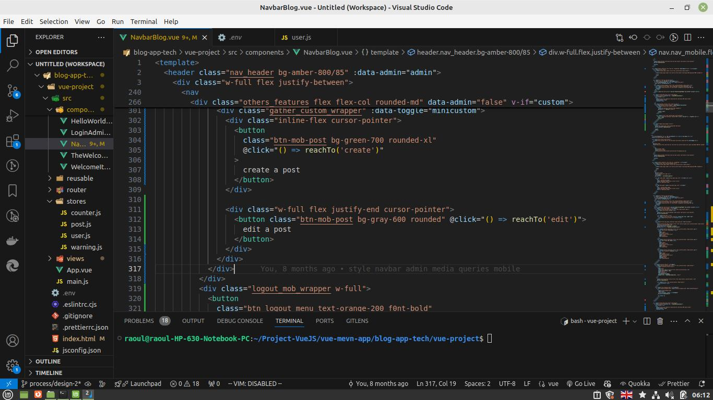
  </li>
  <li style="width:100%; height:100%">
  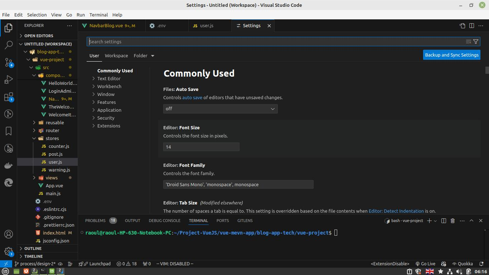
  </li>
  <li style="position:absolute; top:-2.2rem; width:100%; padding:10px 0; text-align:center">
  
 Ctrl + < 

  </li>
</ul>

Over the next Level of our discussion , we will assume, all the times, excepts a contrary notification that any command beginning with `Ctrl` Button (linux, windows OS ) will be replaced by the similar one `⌘` in a mac OS .
We will also keep our cursor within a window **editing area** of vscode when composing the combination's shortcut commands keys. In order to have it working.

**shortcuts commands** on vscode IDE Interface can help us over :

1 - **Navigation**

2 - **Displaying**

3 - **Editing**

4 - **Workspace**

 

### I - NAVIGATION

Vscode displays three majors area that certainly hook our interests most of the time , writing syntax of an app or testing code. These are :

    •  1 The Repertory area
    •  2 The Tab files area
    •  3 The Editing area

Like seen in the image below.

 

<ul style="list-style:none; position:relative; width:100%; max-width: 1040px; padding: 0.5rem; display:grid; grid-template-columns: repeat(auto-fit, minmax(200px, 1fr)); grid-auto-rows:min-content;  gap:1rem">
  <li style="width:100%; height:100%">
  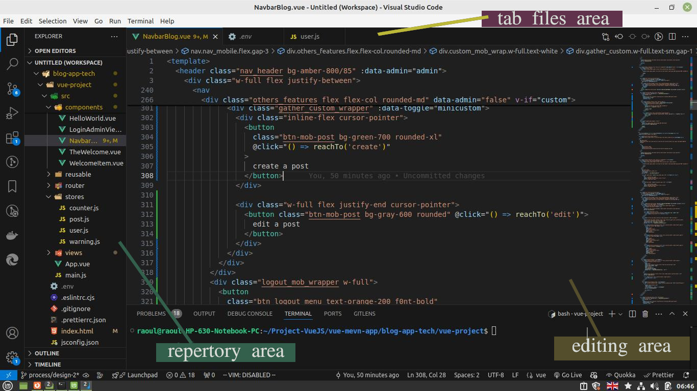
  </li>
  <li style="position:absolute; top:-2.2rem; width:100%; padding:10px 0; text-align:center">
  
 3 areas 

  </li>
</ul>

#### I-1 Repertory Area (Ctrl + 0 )

The shortcut command `Ctrl + 0` give quick access to the **Repertory area** while editing . You switch from the ~ /editing area ~ to the ~ /repertory area ~ almost instantly , giving to multiples directory and files an access to be browsed, reviewed and re-structured in necessary case.
Under `repertory area` navigation from one file/directory to another is made using **directional keyboard buttons**. Files can be opened clicking on **ENTER**, and we can switch back once again to the **editing area** combining the same shortcut key's command.

#### I-2 Tab Files Area (Alt + 1 or 2 , 3, etc )

While having your vscode's window open , browses back and forth from one file to another of the same **editing group** area using the shortcut command :

> - `Alt + 1 or 2 , 3, ...`

Just name the right `number` before `Alt` and shift from your current file to the file located at that specific position. This quite for sure one will take your attention to how powerful you can take control over vscode.

 

<ul style="list-style:none; position:relative; width:100%; max-width: 1040px; padding: 0.5rem; display:grid; grid-template-columns: repeat(auto-fit, minmax(200px, 1fr)); grid-auto-rows:min-content;  gap:1rem">
  <li style="width:100%; height:100%">
  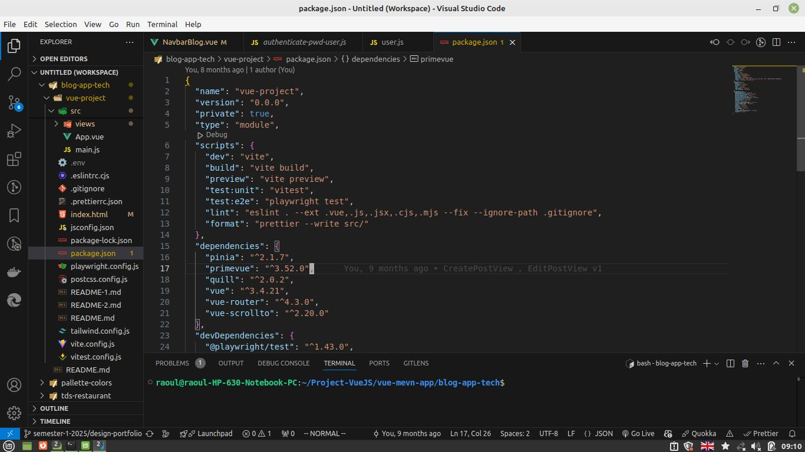
  </li>
  <li style="position:absolute; top:-2.2rem; width:100%; padding:10px 0; text-align:center">
  
 Alt + 4 

  </li>
</ul>

#### I-3 Editing Area (Ctrl+K Ctrl + ←)

**Editings area** are actually place you can write, edit, delete your syntax.

There are sitution where within a **container block element**, you want to reach other previous or next block's elements jumping quickly to their specific location under the file. The use of commands like :

> - `Alt + ↓` or `Alt + ↑` will make sure you jump back and forth faster over all your block lines of code.

 

> - `Alt + PgUp` or `Alt + PgDn` will allow you to scroll the page up and down to reach a certain block or section.

 

> - `Ctrl+K Ctrl + ←` or `Ctrl+K Ctrl + →` will help you navigate from two **editor groups** and right to the place wgere the editing cursor where left.

 

 

### II- DISPLAYING

#### II-1 editings group alignment

For those who have been familiar a bit with CSS styling . Some of the time while building a web layout page we align box's content like text or image over the horizontal-axis , vertical-axis, depending on the size screen. The same parallel apply to vscode when displaying multiple opened **editor groups** in a ~ single window ~. You may decide to align them along the vertical or horizontal as your preferences.

The command :

> - **Shift+Alt+0**

will enable you to do so, as your convenience.

 

<ul style="list-style:none; position:relative; width:100%; max-width: 1040px; padding: 0.5rem; display:grid; grid-template-columns: repeat(auto-fit, minmax(200px, 1fr)); grid-auto-rows:min-content;  gap:1rem">
  <li style="width:100%; height:100%">
  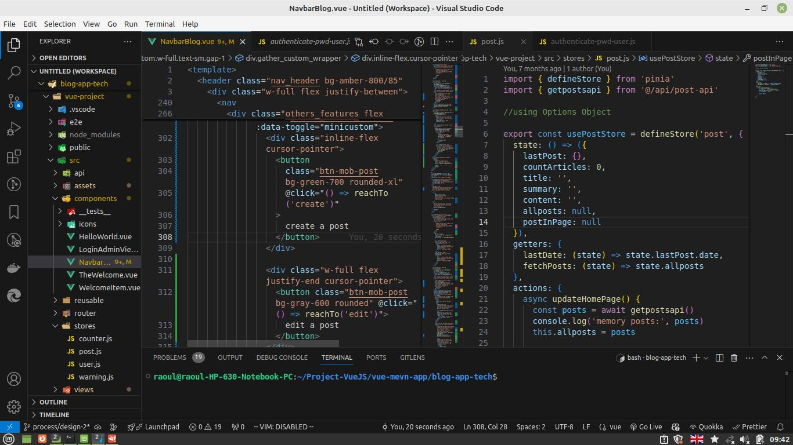
  </li>
  <li style="width:100%; height:100%">
  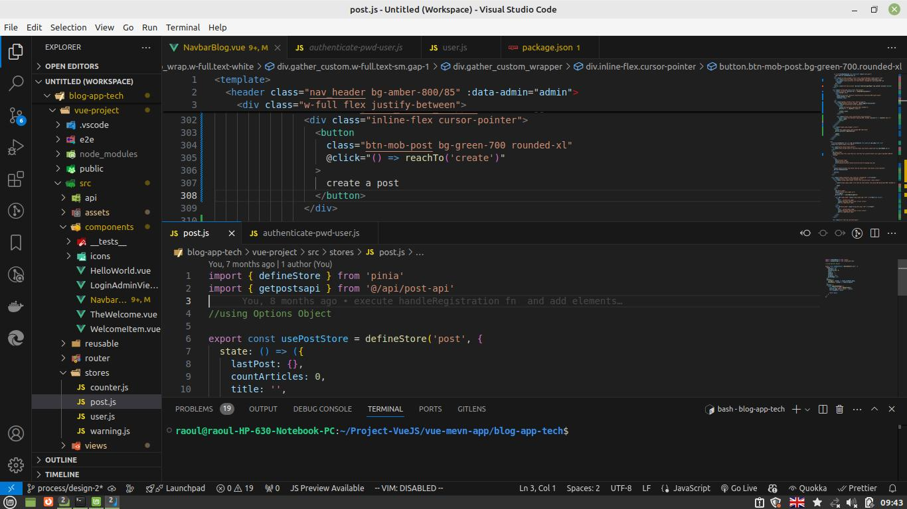
  </li>
  <li style="position:absolute; top:-2.2rem; width:100%; padding:10px 0; text-align:center">
  
 Shift+Alt+0 

  </li>
</ul>

#### II-2 editings group zoom

If in revanche you want to emphasize the view over a file, shrinking, growing the **editing area** window to contrast text size or pull over more contents. You will be in need to go for commands :

> - `Ctrl +` or `Ctrl –` that allows **zoom in** or **zoom out** over a file.

 

#### II-3 editings group zen mode

Situation comes where at a certain point your file becomes strecth and looking inside editing area for large content becomes difficult. This is usually simply the right time to zoom over the whole screen to closely looks under stretch syntax and try to figure out solutions over **spinning** issues you continuously comes upon inside your code. Use the command :

> - Ctrl +K Z and open the file in **Zen Mode**.

Take attention performing this command , having `K` and `Z` spaced means hit the combination `Ctrl + K` first, release the ctrl button , and then click to `Z`.

**Esc** is the button to exit zen mode .

 

<ul style="list-style:none; position:relative; width:100%; max-width: 1040px; padding: 0.5rem; display:grid; grid-template-columns: repeat(auto-fit, minmax(200px, 1fr)); grid-auto-rows:min-content;  gap:1rem">
  <li style="width:100%; height:100%">
  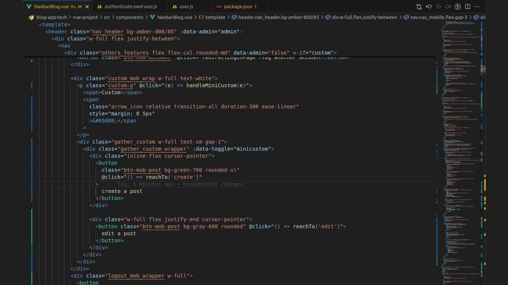
  </li>
  <li style="position:absolute; top:-2.2rem; width:100%; padding:10px 0; text-align:center">
  
 zen mode 

  </li>
</ul>

 

### III- EDITING

We all time to manipulate line(s), block or section elements while writing code syntax inside the **Editing area**.

#### III-1 Occurrence

Back when i was starting coding, i wasn't considering the necessity to use `shortcut commands`, that brought me into a lot of trouble spending too much of time on styling webpage with CSS , i was unable to put my hands on the sets of properties written that pull down my design not allowing new CSS changes to proceed and update the DOM (Document Object Model). It is just when i finally discover the following command that are really take control over my css **classes**. This will also allow you to check quickly any **word** by select **all occurrences** this **one**. Thw command is :

> - `Ctrl + D`

 

My name for this command is : ~ **Control Diffusion**. Thankfully, I was yet able to find any css class ( name) easily in a file, recording all the lines involves with a specific class name and inherit the power to look over all the properties applied to this class . My **set of changes** was now controllable and i could follow up finding what is keeping my progress, anytime i misuse properties in my code. The command is just tremendously helpful.

#### III-2 Formatting

**One line**

When always suppressing line or couples of lines. I notice there are extra spaces remaining that you do not want and you have to delete once again to have a good format with the left code. This take your focus away and divert you even if you just spend few seconds doing it. Trying to relate your mind again and agin after a deletion to what to do next before proceeding. The command :

> - `Ctrl + L `

Select one or multiples lines depending on how many times the combination giving you opportunity to delete line faster.

**Multiple Lines**

As incredible the command **Ctrl + L** is for deletion. We don’t want to miss attention and suppress part of lines we were not intended to remove. As **Ctrl + L** is a rough command for selecting multiple lines, created on purpose to select one line.
It will be good if we can look for a easier solution to wrap a block once. Yet we are used to select couple of lines , block, section relying under the **old formula** : `cursor pointer` put on the beginning block → **scroll** to the **end of the block**, place the mouse near the endpoint block and hit cmd : `Shift + left-click` to the mouse button.

This formula work well when the blocks **doesn't extend out** of the view content. But in case it does, we continuously have to scroll to meet the end, then the formula becomes insecure, despite all the attention, scrolling to reveal more contents can accidently lead to a mess , mixing up ending tag, and deleting content not included in the block. To avoid this silly situation, we must use the command :

> - `Shift + Alt + →` to give us control and selection over all blocks element under a **block container**.

The revert command :

> - `Shift + Alt +  ←` will deselect all these blocks element to easy continue o mover over other conyents of our file.

Yeah It is just: Amazing !

 

<ul style="list-style:none; position:relative; width:100%; max-width: 1040px; padding: 0.5rem; display:grid; grid-template-columns: repeat(auto-fit, minmax(200px, 1fr)); grid-auto-rows:min-content;  gap:1rem">
  <li style="width:100%; height:100%">
  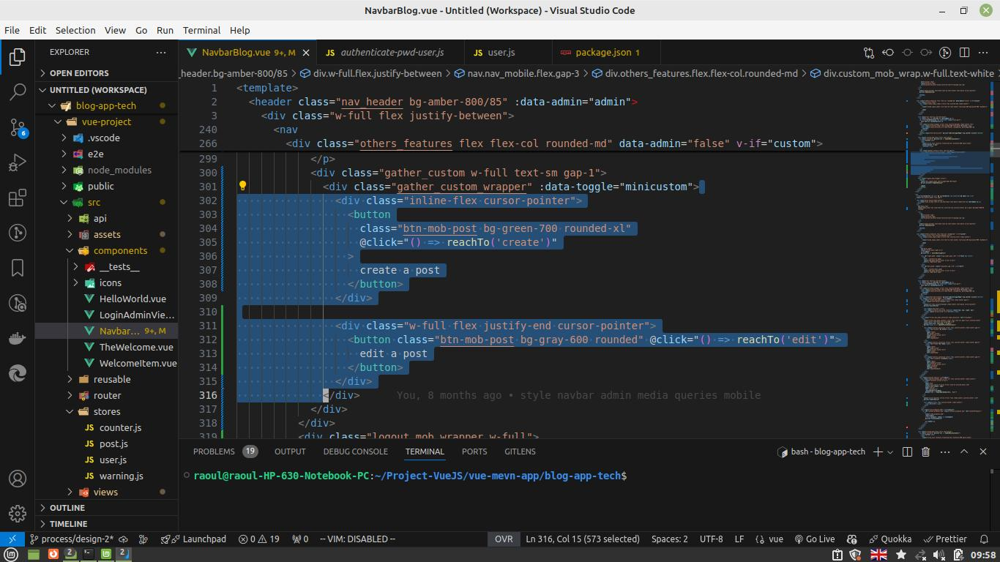
  </li>
  <li style="position:absolute; top:-2.2rem; width:100%; padding:10px 0; text-align:center">
  
 Shift + Alt + → 

  </li>
</ul>

#### III-3 Fold/Unfold Block

When lines of code become incredibly longer, focusing on specific blocks , sections, functions leaving all others syntax hidden can huge be of one help mostly while editing wide syntaxes over JavaScript, HTML, or CSS file.

There is one command that allow you to fold / unfold blocks of code :

> - Ctrl K + Ctrl L

Anytime you see yourself in a situation of a plurality of sections to looks over , think to grasp the earlier command, fold some section and capitalize the update of your file with the rest left open, repeat the process again and again until you finish your review.

 

<ul style="list-style:none; position:relative; width:100%; max-width: 1040px; padding: 0.5rem; display:grid; grid-template-columns: repeat(auto-fit, minmax(200px, 1fr)); grid-auto-rows:min-content;  gap:1rem">
  <li style="width:100%; height:100%">
  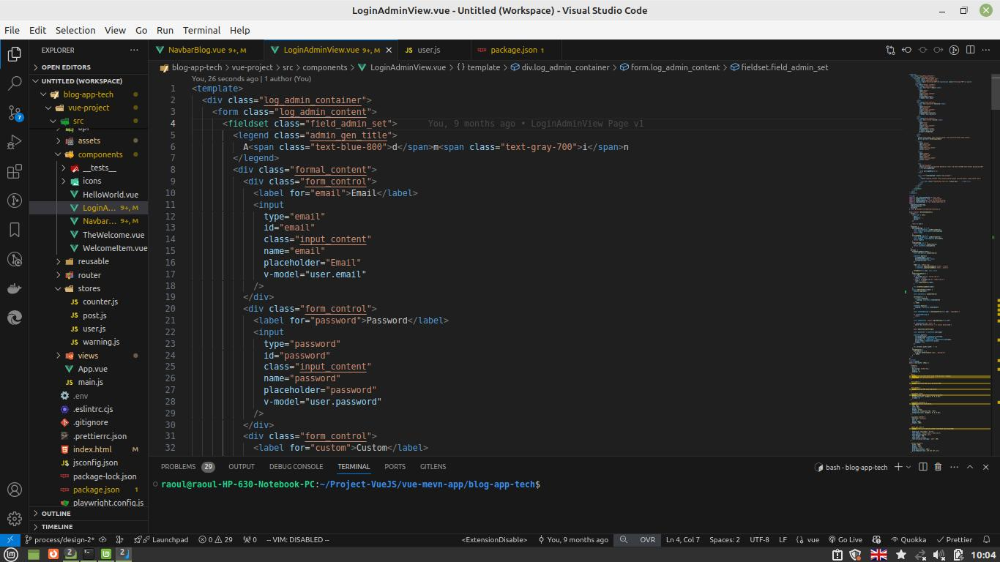
  </li>
  <li style="width:100%; height:100%">
  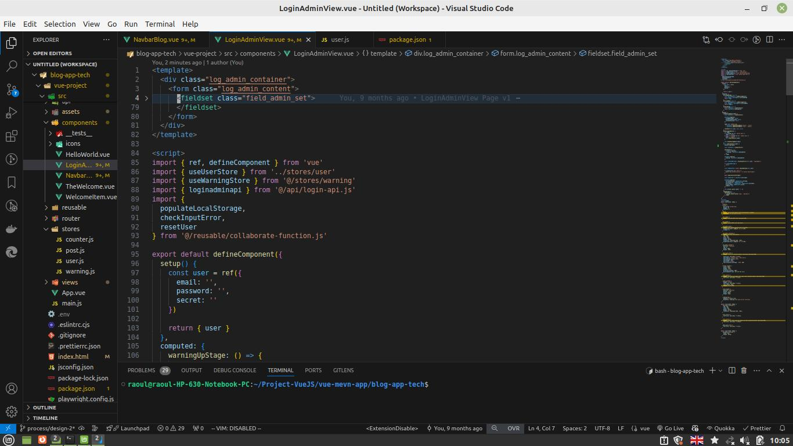
  </li>
  <li style="position:absolute; top:-2.2rem; width:100%; padding:10px 0; text-align:center">
  
 Ctrl K + Ctrl L 

  </li>
</ul>

 

### IV – WorkSPace

This section is not about short command , but I felt the necessity to insert it under our building to help reorganize efficiently any of our work under VsCode .

Basically, all projects we open in VsCode are not for full working.
Some of them could are couples lines of code to test.
While others belongs to real projects we are developing. To make this gap clear enough while using vscode. We can create several **workspace environments** and group test code on **one side** and projects code on **other side**. These divisions keep vscode's windows organized over a same **goal**, and enable us to choose for the right **workspace** to work on, each time we open vscode.

Here Below is how simple you can create a **Workspace Environment**.

Click the **file** tab under the top first bar of vscode window.
You will then see bunch of tag’s elements.

Go For the option :

> **Save Workspace As …**

Hit **ENTER** and fill :

- The _Environment Name_
  >
- Specify The _location_ where you want to save the specific **workspace environment**.

Nice! You have a ready environment that you can open at any time, letting you focus on your tasks .

 

<ul style="list-style:none; position:relative; width:100%; max-width: 1040px; padding: 0.5rem; display:grid; grid-template-columns: repeat(auto-fit, minmax(200px, 1fr)); grid-auto-rows:min-content;  gap:1rem">
  <li style="width:100%; height:100%">
  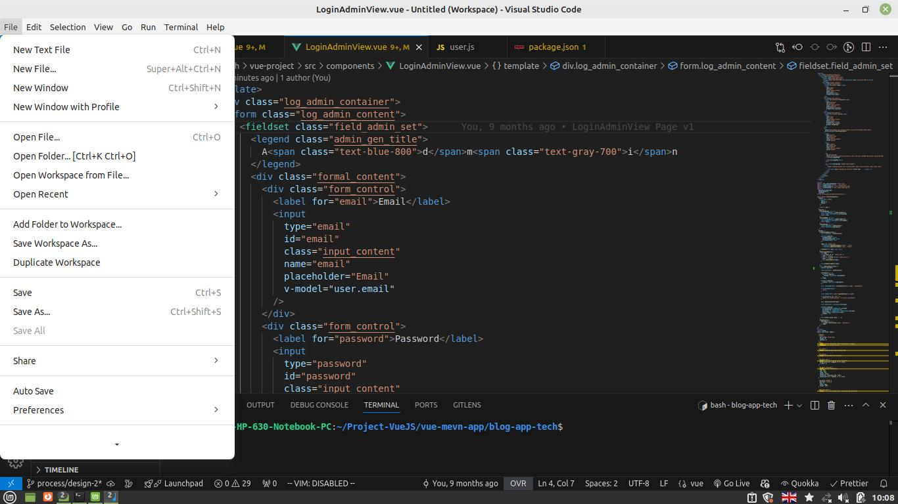
  </li>
  <li style="position:absolute; top:-2.2rem; width:100%; padding:10px 0; text-align:center">
  
file 

  </li>
</ul>

We can repeat :

- click **file** tab
- select : **New Window** , to start a new Vscode window.
  >

And register a new **workspace environment**.

By This way we keep structured control our similar projects in one window, setting boundaries to better work on every part of technology, projects, or programming languages we want to test on vscode.

### Bonus

**Clustered window :**

- many editor groups ,
- panel command (integrated terminal) ,
- repertory area,

> All open at the same time .
>  

Release some of the panels from vscode.

commands as :

> `Ctrl + B`

Will be able to toggle and hide the **repertory area** with ease freeing some space.

>

> Ctrl + shift + C

will quickly open the root directory of your app project in a new shell window , enabling you to run the project or install additional packages needed to it, out of vscode. This opportunity extend the editing area , if we close the integrated terminal in vscode

### Notes

The list **shortcut commands** in vscode is exhaustive.
You might want to download official vscode’s sheet-sheet documentation available for linux, macOS, windows under the links below:

[https://code.visualstudio.com/shortcuts/keyboard-shortcuts-linux.pdf](https://code.visualstudio.com/shortcuts/keyboard-shortcuts-linux.pdf)

>

[https://code.visualstudio.com/shortcuts/keyboard-shortcuts-macos.pdf](https://code.visualstudio.com/shortcuts/keyboard-shortcuts-macos.pdf)

>

[https://code.visualstudio.com/shortcuts/keyboard-shortcuts-windows.pdf](https://code.visualstudio.com/shortcuts/keyboard-shortcuts-windows.pdf)

#### Let’s have fast production on projects !
