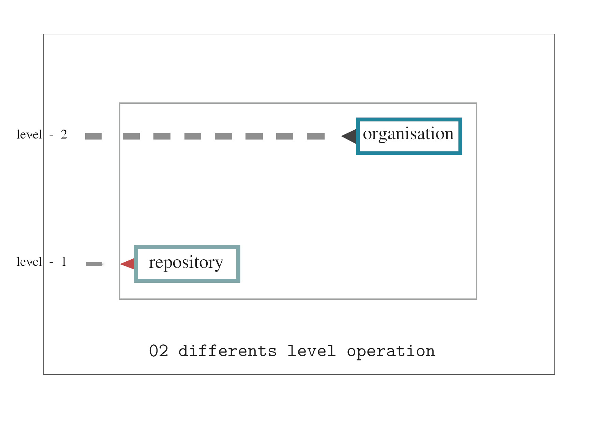
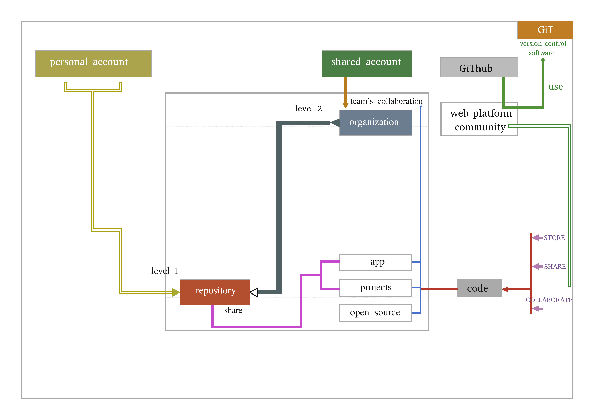

## Github : Repository or Organisation

### Introduction

The first times i was introduced to a github's organization was by a secondary's school classmate becomes a Tech. By the times i went gladly to made my first portfolio while he invited me to join a newer organization he created for both of us, under the wave of marketing my skills and maybe doing further projects together, sending my portfolio in it will be the start .
It was so quick, no preliminary good introduction on what the organization is in first place.I was just left with words to make my own research on it like a tech guy. I really felt unease about this response, but i didn't want to express it. I couldn't make sense of the need of an organization for a merely portfolio ? And i didn't think is even right. Nonetheless i did the research, but the bunch of information given to explain the subject doesn't confer me on that time a sense of understanding. Being tied, just left to trust the fact that fellowship brought me into it , i picture my esteem was left out right from the day of birth of that organization. Then i didn't collaborate too much on whatever the growing spirit of that one. That made me finally mind every time this come back to me , the need to write a guidance article about **Repository** and **Organization** under github. A refresher of what users or future users can really expect giving to be a part of an organization or the one opening a new repository, pointing to also the differences between the two concepts.

### Body

Before proceeding readers need to have some basic knowledge about **github** and **git version control**.

### Overview

We can view **repository** and **organization** under **two separate levels** operation.
One on top level organization while the other at the bottom repository.

 

### I- Repository

A **Repository** is the basic unit in github . Everyone who opens a _github's account_, also open it first **repository**. Because any github account create a primary and customizable repository that the name is as same as your **username's** account. It is often misunderstood to a **project** , but it slide from it. It's likely more ~ a **place** where you can store bunch of things : `code`, `images`, `files` , `folders` in a easier structured way. It is a piece of memory allocated online who hold your root work's project case folder. It is convenient to frame it as a box containing all the files , photos, testimonies , physical evidences that represents the proper investigations of the police under one affair of crime or illegal act affecting citizens under a state, located in a **specific drawer's row** (with key number) under the archive building of the police office's station.

To consider the possible role of the repository in Tech is to watch the countless applications built everyday. This wouldn't be effective if the entire structure of app couldn't be trackable and updated. Making easy for others to participate on projects initiated from peer. The range of **actions** you can adopt out of a basic stored box for making an application alive are multiple. We want to recap some of those before diving into what is an organization.

Mind this, each time you think about **repository** always thinks about **collaboration** and gradually you will grasp the concepts **evolving** around.

You can easily create a repository, in just a few minutes, if you get little knowledge using github. But we aren't talking about repositories's **creation** , we lean rather to provide insights to some basic **actions** you can perform upon those one to better share your work as a contributor or a solo developer on a project.

Here are some of the actions you might perform over your **repository** :

### 1.clone

Imagine you made so much change over files inside a local project dwelling in your computer , and then, end up messing around. Your app return a white blank page, and looking and finding issues you can understand the printed error that your computer send back o you. You are stuck in the middle of nowhere and you seem to have no effective solution for finding the rail road to your way back.
A downward situation you didn't expect, that would kills you times if all changes is to be reversed. You got lazy, your brain yield no! And also you got goosebumps and deep worries, your body doesn't like the situation anymore. Don't want to navigate in that antartic iceberg without a compass : what will be the mission !? On that moment think of **cloning** an **earlier** version of your repository laying in your github account.

This link will explain you more in details how you might take advantages as you **clone** a repository :

[https://docs.github.com/en/repositories/creating-and-managing-repositories/cloning-a-repository](https://docs.github.com/en/repositories/creating-and-managing-repositories/cloning-a-repository)

### 2.branch

The fact that you mess up with your code while working on diverse change can clearly be avoid if creating a **branch** is soon an option coming to you. Well it is not secure to implement a lot of syntax or code that might not work at the end because there are new concepts we not fully master that we apply to kick our project on. New concepts, new features, new update, **new branch!!!**. A repository primary give you access to the **main** branch.

syntax: `git branch -M main` initialize the **core branch** branch of your repository to be referred (or _called_) **main**

Any new **branch** that comes after will intend to store the work you are not feeling sure when adding it. The new code change syntax will not affect the pillar of the building, since their execution are made somewhere else. Your project run and work but in an set apart room. You must create actually more than one branch to test subsequent code if their is the desire. Bu sticking to resolve one problem each after other allow to think is good to create one branch, apply modification, end with it, before creating another subsequent branch. Once you are ready , code can be insert to the main branch by a process called **merging**. Any **branch** need to have a proper name describing why it `meant to do`.

Ensure you **switch** from an old branch to current branch you want before starting to write code on a specific purpose. Else the change we remain to the old branch and it will takes you to difficulty in case any trouble appears. **git** has commands to how **_switch from one branch to another_**, enter in the shell root of your project , they does the work.

### 3.pull request

Once you adapt and verify the new set change of your code are working under a specific branch other than the main. It is time to push these change into the main branch. To do that, you have to initiate a **pull request**
. It will send a message or precisely a notification to the **owner** of the repository that some change has been made in precise file. showing the difference between the current content files in github and the sent update files. After review the owner can directly `merge` your change to his main branch or sent you back inside the same pull request aspects to prioritize improving again before accepting the merge. If you are the owner of the repository, while opening the repository on github a notification message with a call to action to **merge** will be insert to your github's repository page, and quite noticeable.
The work more traceable and efficient to change with this delightful ability.

Documentation Pull Request: [https://docs.github.com/en/pull-requests/collaborating-with-pull-requests/proposing-changes-to-your-work-with-pull-requests/about-pull-requests](https://docs.github.com/en/pull-requests/collaborating-with-pull-requests/proposing-changes-to-your-work-with-pull-requests/about-pull-requests)

### 4.merge

**compare and merge** is the last process you apply to a specific branch in order to join the main branch. **Comparing** let you look at differences and conflicts between the code lines of the current files you change in the local repository and the remote repository on github. The **merge** process is possible after all the conflicts have been set if there are, sending your current modification in the main branch.

During this process you will also experience how powerful **Git** track changes on a repository.

Github Merge branch : [https://docs.github.com/en/pull-requests/collaborating-with-pull-requests/incorporating-changes-from-a-pull-request/merging-a-pull-request](https://docs.github.com/en/pull-requests/collaborating-with-pull-requests/incorporating-changes-from-a-pull-request/merging-a-pull-request)

### 5.Fork

**Fork** is also an act of **copy** as **_clone_**, the difference is that the copy is made online, mostly from a repository that is not yours to your **repository**. Maybe you have seen some cool features, animations, someone made in his github repository and you want to keep it to inspire over times with the others many bunch of stuff you are doing. You then fork the repository! Making one copy visible and accessible in your own onboard online repositories page. And ready to check anytime you need a guidance. You can track if the owner has update the repository and also update the version of his repository laying into you board page. But you can't modify something inside , except you reach the owner with an update in a pull request, wishing it would be applied.

 

### II- Organization

**Organization** at the top board operation than a repository

The name organization evoke **enterprize**. While a repository is a `place to store code` (and you need to have a github account to do that). An **Organization** on the other side is a **group of Github Account** organized as a crew, that work and contribute to solo projects of their own or others company already in place, or participate to open source online projects. Their publication are made under the **organization's** name not than an individual github's account name.

This team have a structure of a company . The work done are also submitted by an individual or a sub-team to managers that evaluate their course and implementation along with the vision of the group or the boundaries of development. The managers take **decisions** and set **permissions** and **right** to each nested team or personal account. The managers are **owners** of the organization.

Any members (github's account) has opportunities to start discussion, express their values propositions for a project inside the organization board, but are restricted to the access and set of rules, granted by owners over their work.That means some of conversation could be no available to some of the people among the group. An Organization enhance several level of security than a regular repository, that is why they are vital implementation for huge projects that need to be worked on.
Instead of individual contribution to repository , an organization gathers developers desired under a same mansion . Where all their act are accounted not individually but for the sake of the mansion progress and recognition. Product or services in demands implement fast when their is timeless communication due to the fact that all the people involved are in the same place, accessing information memo for development at the necessary time.

Let's bring out what kind of management you could possibly achieve creating an **organization** a shelter to many github's account :

There are two kinds of known worker in an industry:

- standard employees
- managers

All decisions made in a nested team( or individual account) has to pass the approval of your direct manager(s) to no be consequential all on you if something kick the bed down. The manager is supposed to be a guide in the aspect decision making giving you specific advise on where to go , begin , or move on under certain particular problems, or take your proposition as welcoming. As say earlier they might have the vision ,the experience, even if they do not have the right skill to solve the actual problem, but most often they are also skilled to some area of IT skills and their knowledge comes out also as an asset.

Managers in a Github organization are called **organization's owners**. And here they possess rights that goes from inviting someone in joining the organization, to managing **access** of all **resources and permissions** that might be granted to individual account or a nested group inside the organization.

For Employees (simple invited account) you are given role according to your skills and this role come also with a set of **permissions** to be not overwhelmed and more often enhance security access on different aspects of a project. As we usually see, in corporation the lower you are on the ladder, the more you don't have access to to the decisions leading the firm..

To recap , being a **part** of an **organization** brings strength level of security in the projects built. You have a wide range of experienced people and that is an asset to scale your growth rapidly, gain trust from others company, participate to side projects of others company in need of outsiders in a short period time to boost their projects.

These are freedom or will power while being an **organization owner** :

1. **manage access to the organization**

   > Invite people
   > Assign them role
   > Grant them some level of access

2. **manage access to resources by any nested teams in your organization**

   > Repositories
   > Projects
   > Apps

3. **Configure the organization to meet yor vision and need**
   > Restricts Types of repositories that could be created.
   > Allow members to have cascaded permissions individually and in the nested teams they are involved
   > Bring a scalable level of security to your app, project, and give you the track to focus effort to improve solutions for the matter you are working on or the product you are developing.

You can have additional information about **organization** if you might need it.

On the github documentation below you view in details why and how and organization can be a good way to scale up, collaborate and build teams.

**About Organization** : [https://docs.github.com/en/organizations/collaborating-with-groups-in-organizations/about-organizations](https://docs.github.com/en/organizations/collaborating-with-groups-in-organizations/about-organizations)

Thanks you to join me in any part of this article that need more explanations or elaboration.

twitter : [https://twitter.com/nest_Ngoueni](https://twitter.com/nest_Ngoueni)

linkedin : [https://www.linkedin.com/in/gerard-ngouend-5a0584244/](https://www.linkedin.com/in/gerard-ngouend-5a0584244/)
